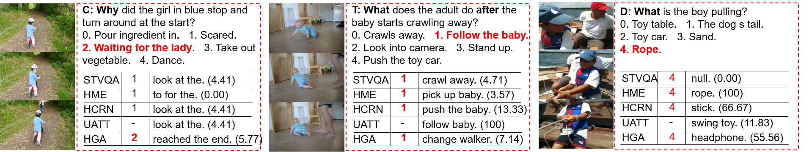

# NExT-QA 

We reproduce some SOTA VideoQA methods to provide benchmark results for our NExT-QA dataset accepted to CVPR2021 (with 1 'Strong Accept' and 2 'Weak Accept's). 

NExT-QA is a VideoQA benchmark targeting the explanation of video contents. It challenges QA models to reason about the causal and temporal actions and understand the rich object interactions in daily activities. We set up both multi-choice and open-ended QA tasks on the dataset. <strong>This repo. provides resources for open-ended QA</strong>; multi-choice QA is found in [NExT-QA](https://github.com/doc-doc/NExT-QA). For more details, please refer to our [dataset](https://doc-doc.github.io/docs/nextqa.html) page.

## Environment

Anaconda 4.8.4, python 3.6.8, pytorch 1.6 and cuda 10.2. For other libs, please refer to the file requirements.txt.

## Install
Please create an env for this project using anaconda (should install [anaconda](https://docs.anaconda.com/anaconda/install/linux/) first)
```
>conda create -n videoqa python==3.6.8
>conda activate videoqa
>git clone https://github.com/doc-doc/NExT-OE.git
>pip install -r requirements.txt
```
## Data Preparation
Please download the pre-computed features and QA annotations from [here](https://drive.google.com/drive/folders/14jSt4sGFQaZxBu4AGL2Svj34fUhcK2u0?usp=sharing). There are 3 zip files: 
- ```['vid_feat.zip']```: Appearance and motion feature for video representation (same as multi-choice QA).
- ```['nextqa.zip']```: Annotations of QAs and GloVe Embeddings (open-ended version). 
- ```['models.zip']```: HGA model (open-ended version). 

After downloading the data, please create a folder ```['data/feats']``` at the same directory as ```['NExT-OE']```, then unzip the video features into it. You will have directories like ```['data/feats/vid_feat/', and 'NExT-OE/']``` in your workspace. Please unzip the files in ```['nextqa.zip']``` into ```['NExT-OE/dataset/nextqa']``` and ```['models.zip']``` into ```['NExT-OE/models/']```. 


## Usage
Once the data is ready, you can easily run the code. First, to test the environment and code, we provide the prediction and model of the SOTA approach (i.e., HGA) on NExT-QA. 
You can get the results reported in the paper by running: 
```
>python eval_oe.py
```
The command above will load the prediction file under ['results/'] and evaluate it. 
You can also obtain the prediction by running: 
```
>./main.sh 0 val #Test the model with GPU id 0
```
The command above will load the model under ['models/'] and generate the prediction file.
If you want to train the model, please run
```
>./main.sh 0 train # Train the model with GPU id 0
```
It will train the model and save to ['models']. (*The results may be slightly different depending on the environments*)
## Results
| Methods                  | Text Rep. | WUPS_C | WUPS_T | WUPS_D | WUPS | 
| -------------------------| --------: | ----: | ----: | ----: | ---:| 
| BlindQA                  |   GloVe   | 12.14 | 14.85 | 40.41 | 18.88 | 
| [STVQA](https://openaccess.thecvf.com/content_cvpr_2017/papers/Jang_TGIF-QA_Toward_Spatio-Temporal_CVPR_2017_paper.pdf) [CVPR17]  |   GloVe   | 12.52 | 14.57 | 45.64 | 20.08 | 
| [UATT](https://ieeexplore.ieee.org/document/8017608) [TIP17] | GloVe | 13.62 | **16.23** | 43.41 | 20.65 |
| [HME](https://openaccess.thecvf.com/content_CVPR_2019/papers/Fan_Heterogeneous_Memory_Enhanced_Multimodal_Attention_Model_for_Video_Question_Answering_CVPR_2019_paper.pdf) [CVPR19]    |   GloVe   | 12.83 | 14.76 | 45.13 | 20.18 | 
| [HCRN](https://openaccess.thecvf.com/content_CVPR_2020/papers/Le_Hierarchical_Conditional_Relation_Networks_for_Video_Question_Answering_CVPR_2020_paper.pdf) [CVPR20]   |   GloVe   | 12.53 | 15.37 | 45.29 | 20.25 | 
| [HGA](https://ojs.aaai.org//index.php/AAAI/article/view/6767) [AAAI20]    |   GloVe   | **14.76** | 14.90 | **46.60** | **21.48** |

## Multi-choice QA *vs.* Open-ended QA

## Citation
```
@article{xiao2021next,
  title={NExT-QA: Next Phase of Question-Answering to Explaining Temporal Actions},
  author={Xiao, Junbin and Shang, Xindi and Yao, Angela and Chua, Tat-Seng},
  journal={arXiv preprint arXiv:2105.08276},
  year={2021}
}
```
## Todo
1. [ ] Open online evaluation server and release test data.
2. [ ] Release spatial feature.
3. [ ] Release RoI feature.
## Acknowledgement
Our reproduction of the methods are based on the respective official repositories, we thank the authors to release their code. If you use the related part, please cite the corresponding paper commented in the code.
